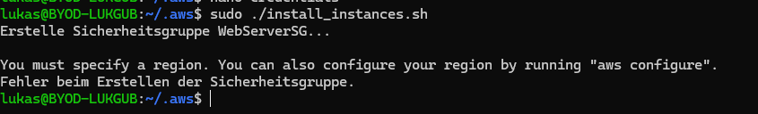

# Dokumentation

## Inhalt

- [Dokumentation](#dokumentation)
  - [Inhalt](#inhalt)
  - [Auftrag](#auftrag)
  - [Umsetzung](#umsetzung)
  - [Inbetriebnahme](#inbetriebnahme)
  - [Konfigurationsdateien](#konfigurationsdateien)
  - [Tests](#tests)
  - [Webserver](#webserver)
  - [Datenbank](#datenbank)
  - [Automatisierung](#automatisierung)
  - [Reflexion](#reflexion)
  - [Quellen](#quellen)

## Auftrag

Wir hatten die Wahl, zwischen dem Auftrag mit dem Ticketsystem und einem Content Management System.
Wir haben uns für das Ticketsystem entschieden.
Die Aufgabenstellung vom Ticketsystem lautet:

Installieren Sie ein Ticketsystem ihrer Wahl (z.B. osTicket, zoho, otrs, etc.).

## Umsetzung

Als erstes haben wir gestartet mir der Einrichtung von Git.
Wir haben uns entschieden dieses Projekt mit Githum umzusetzen,da ein Teil unserer Gruppe schon damit gearbeitet hat und wir das als einfachste Lösung zum zusammenarbeiten von diesem Projekt gefunden haben.

Danach haben wir mit der Recherche angefangen. Wir haben als erstes recherchiert, welches Ticketsystem am besten für unser Projekt geeignet ist.
Wir haben uns für das Ticketsystem osTicket entschieden, da das unserer Meinung nach relativ simpel umzusetzen ist.

## Inbetriebnahme

## Konfigurationsdateien

## Tests

## Webserver

## Datenbank

## Automatisierung

## Reflexion

## Quellen
