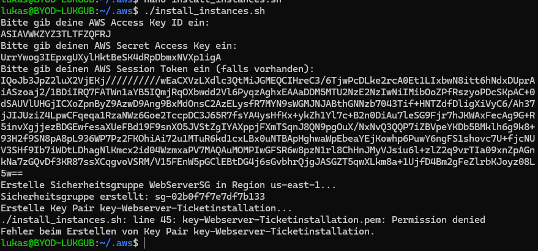

# Dokumentation

## Inhalt

- [Dokumentation](#dokumentation)
  - [Inhalt](#inhalt)
  - [Auftrag](#auftrag)
  - [Umsetzung](#umsetzung)
  - [Inbetriebnahme](#inbetriebnahme)
  - [Konfigurationsdateien](#konfigurationsdateien)
  - [Tests](#tests)
  - [Webserver](#webserver)
  - [Datenbank](#datenbank)
  - [Automatisierung](#automatisierung)
  - [Reflexion](#reflexion)
  - [Quellen](#quellen)

## Auftrag

Wir hatten die Wahl, zwischen dem Auftrag mit dem Ticketsystem und einem Content Management System.
Wir haben uns für das Ticketsystem entschieden.

Die Aufgabe vom Ticketsystem bestand darin, ein Ticketsystem zu installieren und zu konfigurieren.
Dabei standen uns verschiedene Systeme zur Auswahl, darunter osTicket, zoho und otrs.
Wir haben recherchiert, welches System am besten für unser Projekt geeignet ist und haben unds danach für osTicker entschieden, da es eine benutzerfreundliche, leichtgewichtige Lösung für das Ticketsystem darstellt und gut dokumentiert ist.

## Umsetzung

Als erstes haben wir gestartet mir der Einrichtung von Git.
Wir haben uns entschieden dieses Projekt mit Githum umzusetzen,da ein Teil unserer Gruppe schon damit gearbeitet hat und wir das als einfachste Lösung zum zusammenarbeiten von diesem Projekt gefunden haben.

Danach haben wir mit der Recherche angefangen. Wir haben als erstes recherchiert, welches Ticketsystem am besten für unser Projekt geeignet ist.
Wir haben uns für das Ticketsystem osTicket entschieden, da das unserer Meinung nach relativ simpel umzusetzen ist.

Zuerst haben wir mit der Einrichtung von Git begonnen. Wir haben uns entschieden, dieses Projekt mit GitHub umzusetzen, da ein Teil unserer Gruppe bereits damit gearbeitet hat. GitHub bietet eine einfache Möglichkeit zur Versionskontrolle und Zusammenarbeit bei der Umsetzung des Projekts.

Nach der Einrichtung von Git haben wir mit der Recherche begonnen, um das am besten geeignete Ticketsystem zu wählen. osTicket hat uns aufgrund seiner einfachen Installation und Nutzung überzeugt. Wir haben uns dafür entschieden, das Ticketsystem auf einer Ubuntu-basierten EC2-Instanz bei AWS zu installieren und zu konfigurieren.

## Inbetriebnahme

Die Inbetriebnahme des Systems erfolgte in mehreren Schritten. Zuerst haben wir eine EC2-Instanz in AWS gestartet und konfiguriert. Danach haben wir die nötigen Softwarepakete installiert und den Webserver sowie die Datenbank eingerichtet. Es wurden alle nötigen Schritte unternommen, um das System lauffähig zu machen, einschließlich der Installation von Apache, MySQL und PHP sowie der Konfiguration des osTicket-Systems.

Nach der Installation von osTicket haben wir die Konfiguration des Webservers angepasst und die notwendigen Berechtigungen gesetzt. Der Webserver (Apache) wurde so konfiguriert, dass er osTicket ordnungsgemäß bedienen kann, und die Datenbank (MySQL) wurde mit den entsprechenden Zugangsdaten eingerichtet.

## Konfigurationsdateien

Die Konfiguration von osTicket und des Servers erfolgt hauptsächlich über folgende Dateien:

Apache-Konfiguration:

Die Apache-Konfiguration (osticket.conf) stellt sicher, dass der Webserver Anfragen an das osTicket-System weiterleitet.

osTicket Konfigurationsdatei:

Die Datei ost-config.php enthält die Verbindungseinstellungen zur MySQL-Datenbank und andere systemweite Konfigurationen.

MySQL-Datenbank:

Es wurden SQL-Skripte ausgeführt, um eine neue Datenbank sowie einen Benutzer für das osTicket-System zu erstellen.
Die Konfigurationen wurden so angepasst, dass das System nach der Installation vollständig funktionsfähig ist.

## Tests

## Webserver

Für den Webserver verwenden wir Apache2. Dieser wurde nach der Installation von osTicket konfiguriert, um als Webserver für das Ticketsystem zu fungieren. Wichtige Schritte beinhalteten:

Aktivierung des Apache-Moduls rewrite für URL-Umschreibungen.
Anpassung der Apache-Konfiguration, um die osTicket-Webanwendung zu bedienen.
Sicherstellung, dass der Webserver mit den richtigen Berechtigungen auf die Webdateien zugreifen kann.

## Datenbank

Für die Datenbank haben wir MySQL verwendet. Die Konfiguration umfasste die folgenden Schritte:

Installation von MySQL auf der EC2-Instanz.
Erstellung einer neuen Datenbank für osTicket und eines Datenbankbenutzers mit den entsprechenden Berechtigungen.
Anpassung der MySQL-Einstellungen zur Sicherstellung der ordnungsgemäßen Verbindung mit dem Webserver.

## Automatisierung

Das gesamte Setup, einschließlich der Installation von Software, Konfiguration der Instanz, der Webserver- und Datenbankinstallation sowie der osTicket-Installation, wurde durch zwei Shell-Skripte automatisiert:

EC2 Setup Skript:

Automatisiert das Erstellen der EC2-Instanz, das Einrichten der Sicherheitsgruppen, das Öffnen der notwendigen Ports und das Starten der Instanzen.

osTicket Installationsskript:

Automatisiert die Installation und Konfiguration von Apache, MySQL, PHP und osTicket, einschließlich der Erstellung von Datenbanken, Benutzern und dem Setzen der richtigen Berechtigungen.
Diese Automatisierung spart Zeit und stellt sicher, dass der gesamte Prozess konsistent und wiederholbar durchgeführt werden kann.

## Reflexion

Im Verlauf des Projekts haben wir viel über die Installation und Konfiguration von Webanwendungen und deren Infrastruktur gelernt. Die Entscheidung, ein Ticketsystem zu installieren und zu automatisieren, war eine gute Wahl, da wir nicht nur praktische Fähigkeiten in der Arbeit mit Servern und Datenbanken erlangt haben, sondern auch die Funktionsweise von Systemadministration und Automatisierung in der Praxis besser verstehen konnten.

Einige Herausforderungen traten auf, als es darum ging, alle Komponenten miteinander zu integrieren. Insbesondere die Konfiguration von MySQL und Apache erforderte präzises Vorgehen, um sicherzustellen, dass alles reibungslos zusammenarbeitet. Auch die Automatisierung durch Skripte erwies sich als äußerst nützlich, obwohl es zu Beginn einige Fehler in den Skripten gab, die behoben werden mussten.

Abschließend war das Projekt ein großer Erfolg, und wir konnten das Ticketsystem erfolgreich installieren und in Betrieb nehmen.

## Quellen

[osTicket GitHub Repository](https://github.com/osTicket/osTicket)

[AWS Documentation](https://docs.aws.amazon.com/)

[Apache HTTP Server Documentation](https://httpd.apache.org/)

[MySQL Documentation](https://dev.mysql.com/doc/)
